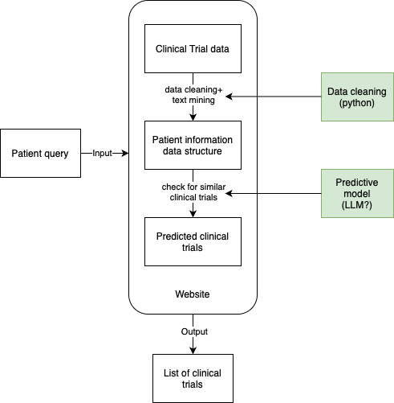

GitHub Repository for BioHacks 2024

The repository contains the code to address the problem statement of Realyze Health, which is to "use LLMs to understand oncology clinical trials." We propose a website for users to query what clinical trials are suitable for them. The outline of our product is as follows:

## Data

We use data downloaded from [https://clinicaltrials.gov](https://clinicaltrials.gov).

The description of the fields is as follows: https://clinicaltrials.gov/study-basics/how-to-read-study-record

