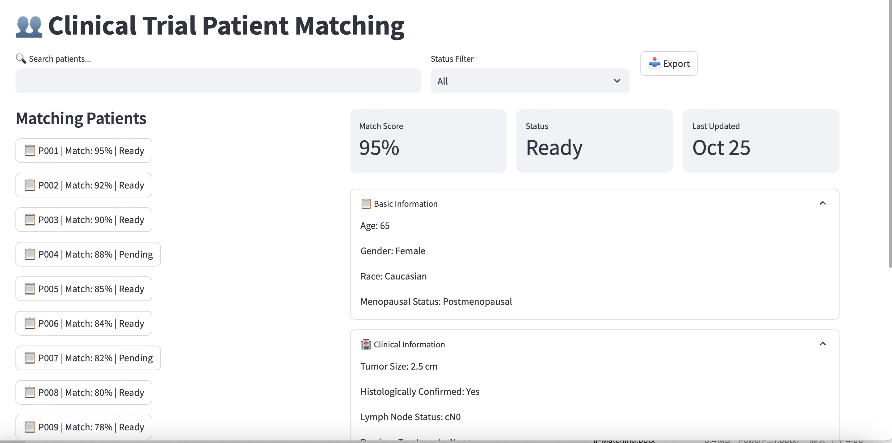

# TrAIls GitHub Repository for BioHacks 2024

The repository contains the code to address the problem statement of Realyze Health, which is to "Use LLMs to understandoncology clinical trials form clincaltrials.org andstructure the inclusion and exclusion criteria sopatients can be match in real time." We propose a novel technical solution for clinical trial coordinators to query what clinical trials are suitable for them. The outline of our product is as follows:

# Data

We use 14,491 clinical trials data downloaded from [https://clinicaltrials.gov](https://clinicaltrials.gov).

We use SyntheaTM Patient Generator [https://github.com/synthetichealth/synthea?tab=readme-ov-file#syntheatm-patient-generator--] to synthesize over 40,000 patients data. 

# Pipeline 

TrAIls uses Retrieval-Augmented Generation (RAG) to match clinical trials and patients by finding the semantic similarity between them.

## Data paraperation
Given the patients info and clinical trails info we collected before, we first use a pretrained clinical information embedding language model: MedEmbed [https://huggingface.co/blog/abhinand/medembed-finetuned-embedding-models-for-medical-ir] to convert them into number vectors and store them in our clinical trials vector database, and our patients information database. This process could preserve the privacy of the patients information.

## Two way to use it
### Pipeline I: Find better matching patients for your trials.

Given the crinical trial, we could retreive matched patients. Then we prompt LLM to generate explanation to provide more AI explainability about why the patient could be a fit.
### Pipeline II: Find the right trails for your patients.

Given the patient information, we could retreive matched crinical trials. Then we prompt LLM to generate explanation to provide more AI explainability about why the trial could be a fit.

# Technologies
We used React, Next.js, Node.js, Flask, Python, JavaScript. \
We use MedEmbed for information embedding. [https://huggingface.co/blog/abhinand/medembed-finetuned-embedding-models-for-medical-ir] \
We use Llama 70B Model as the LLM. [https://arxiv.org/abs/2302.13971]